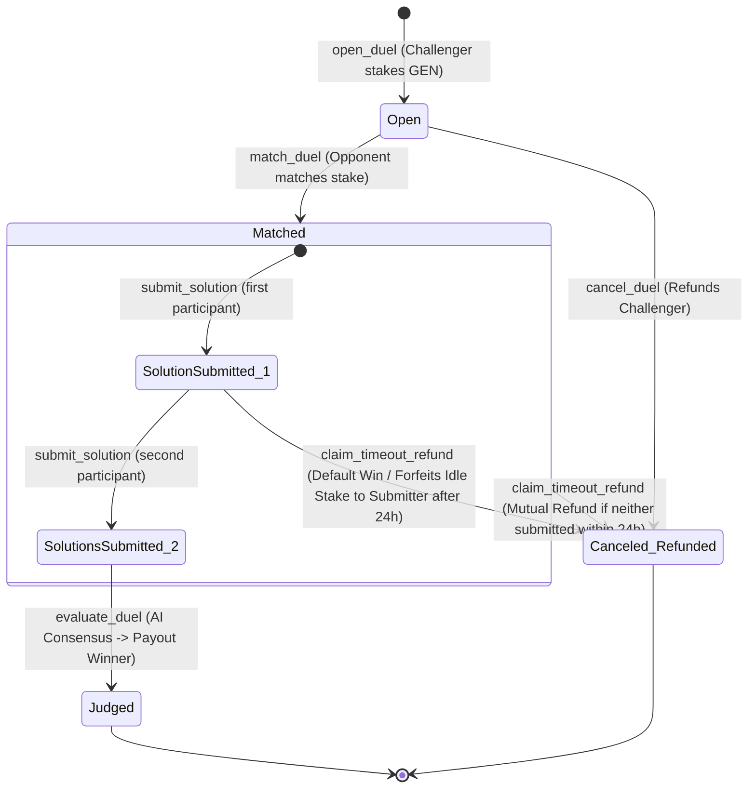

# ⚔️ GLADIUS — Trustless 1v1 Peer Adjudication & AI Consensus Arena

Gladius is a decentralized, high-stakes 1v1 skill contest and semantic resolution arena built on GenLayer. It matches creators, developers, writers, and logicians in duels where subjective tasks are graded trustlessly by a consensus of independent AI validators.

**Live Web Dashboard:** https://gladius-topaz.vercel.app/

**Deployed Contract (GenLayer Studionet):** `0x1d4c3b281FE4d4EAa61cA3AC08AF2a994e83174D`

---

## 🏛️ The Problem & The GenLayer Edge

Smart contracts on traditional blockchains are limited to objective inputs (numbers, hashes, and boolean state checks). They cannot evaluate the elegance of a block of code, verify if a translation is fluent, or score design mockups for aesthetics. Consequently, online creative contests either have zero stakes or rely on slow, expensive, and centralized human judges.

**Gladius** leverages **GenLayer's Intelligent Contracts** to solve this:
1. **Semantic consensus:** Multiple validator nodes independently run Large Language Models to evaluate subjective text submissions.
2. **Equivalence Principle:** Instead of requiring matching binary hashes of the outputs, validators check that they agree on the semantic winner and that their scores fall within a defined numeric tolerance (±2).
3. **Automated Settlement:** The prize pool (combined stakes of both players) is held in escrow and distributed programmatically by the contract upon resolution.

---

## 🗺️ State Machine & Battle Flow

The state transitions of a Gladius Duel are mapped in the diagram below:



---

## ⚙️ Key Technical Enhancements

### 1. Gas-Optimized Native Storage Layout
Unlike traditional string-serialized JSON states that require expensive loads and dumps during transactions, Gladius uses native Python dataclasses decorated with `@allow_storage` to handle mapping states:
```python
@allow_storage
@dataclass
class Duel:
    duel_id: u256
    challenger: Address
    opponent: Address
    category: str
    prompt: str
    solution_challenger: str
    solution_opponent: str
    stake_challenger: u256
    stake_opponent: u256
    status: u256
    winner: Address
    verdict_reasoning: str
    score_challenger: u256
    score_opponent: u256
    created_at: u256
    last_action_at: u256
```
This guarantees minimal CPU cycle overhead, prevents state serialization bloat, and decreases gas costs during read/write cycles.

### 2. Game-Theoretic Inactivity Deadlock Protection
To prevent stakes from being trapped in the contract if an opponent goes idle after matching, Gladius implements a 24-hour timeout window (`claim_timeout_refund`):
- **Default Victory:** If Player A submits their solution but Player B fails to submit within the 24-hour limit, Player A can claim the entire pot (Player B's matched stake is forfeited).
- **Mutual Cancellation:** If neither participant uploads a solution within 24 hours, either player can trigger a cancellation to reclaim their respective stake.

---

## 📜 Contract API Reference

### Write Methods
- `open_duel(category: str, prompt: str) -> u256 (payable)`: Registers a new challenge with an initial GEN stake.
- `match_duel(duel_id: u256) (payable)`: Matches the initial stake and locks matchmaking.
- `submit_solution(duel_id: u256, solution: str)`: Submits solution draft. Transitions status to `SolutionsSubmitted` once both are received.
- `evaluate_duel(duel_id: u256)`: Executes the non-deterministic consensus to grade and payout the winner.
- `claim_timeout_refund(duel_id: u256)`: Checks 24-hour inactivity and cancels/distributes stakes accordingly.
- `cancel_duel(duel_id: u256)`: Cancels an unmatched duel and refunds the challenger.

### View Methods
- `get_duel(duel_id: u256) -> dict`: Returns the full state of a duel.
- `get_duel_count() -> u256`: Returns total duels created.
- `get_duel_ids() -> list`: Returns all registered duel IDs.

---

## 🛠️ Developer Setup & Local Verification

### Prerequisites
Install Python dependencies and the GenLayer CLI environment:
```bash
# Install Python test suite packages
pip install -r requirements.txt

# Install GenLayer global CLI
npm install -g genlayer
```

### 1. Verification & Linter Checks
Run the GenVM local compiler linter to check validation and methods:
```bash
# Run local lint check
./scripts/lint.sh
```

### 2. Run Automated Unit Test Suite
Gladius includes a comprehensive direct VM unit test suite testing 4 contract lifecycles (matchups, cancellation, consensus success, validator splits, and time-travel inactivity defaults):
```bash
# Run pytest direct suite
pytest tests/direct/test_gladius_arena.py
```

### 3. Deploying to Studionet
Run the deployment guide script to review setup steps:
```bash
python3 scripts/deploy_guide.py
```

### 4. Running the Frontend Dashboard
Navigate to the frontend folder, configure variables, and run locally:
```bash
cd frontend
npm install
npm run dev
```
Open `http://localhost:3000` to review the classy battle dashboard.
